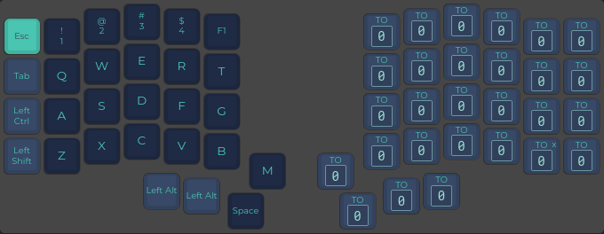

# my QMK keymap for Iris Keyboard
 
## Goodies

- [Caps Word](https://docs.qmk.fm/#/feature_caps_word?id=caps-word) Enabled by double-tapping left shift
- Right shift tapped is ENTER

## Setup dev env


Link sources to qmk firmware dir:

```shell
mkdir /home/$USER/qmk_firmware/keyboards/keebio/iris/rev6b/keymaps/jumski/
ln -s /home/$USER/Code/iris-keymap/{config.h,keymap.c,rules.mk} /home/$USER/qmk_firmware/keyboards/keebio/iris/rev6b/keymaps/jumski/
```

## QWERTY


## LOWER


## RAISE


## ADJUST


## APEX


