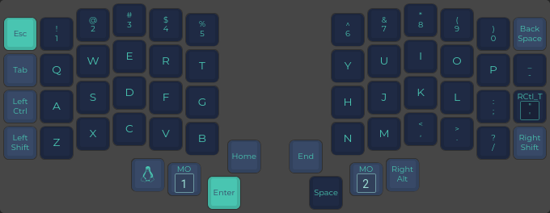

# my QMK keymap for Iris Keyboard

## Setting up the repo

One need to link this repo files:

- `config.h`
- `keymap.c`
- `rules.mk` 

to appropriate folder in qmk_firmware:

`/home/jumski/qmk_firmware/keyboards/keebio/iris/keymaps/jumski`

It should look like this:

```shell
$ pwd
/home/jumski/qmk_firmware/keyboards/keebio/iris/keymaps/jumski

$ ls -l
lrwxrwxrwx    38 jumski  9 gru  2022  config.h -> /home/jumski/Code/iris-keymap/config.h
lrwxrwxrwx    38 jumski 24 lis  2022  keymap.c -> /home/jumski/Code/iris-keymap/keymap.c
lrwxrwxrwx    38 jumski  9 gru  2022  rules.mk -> /home/jumski/Code/iris-keymap/rules.mk
```
 
## Goodies

- [Caps Word](https://docs.qmk.fm/#/feature_caps_word?id=caps-word) - enabled by tapping both shifts at the same time
- APEX layer has alt-tab and alt-space disabled (via custom APEX_ prefixed keycodes)
- APEX layer has tap dance on ESC - one tap does nothing to prevent accidents, need to double tap

## QWERTY



## LOWER


## RAISE


## ADJUST


## APEX


